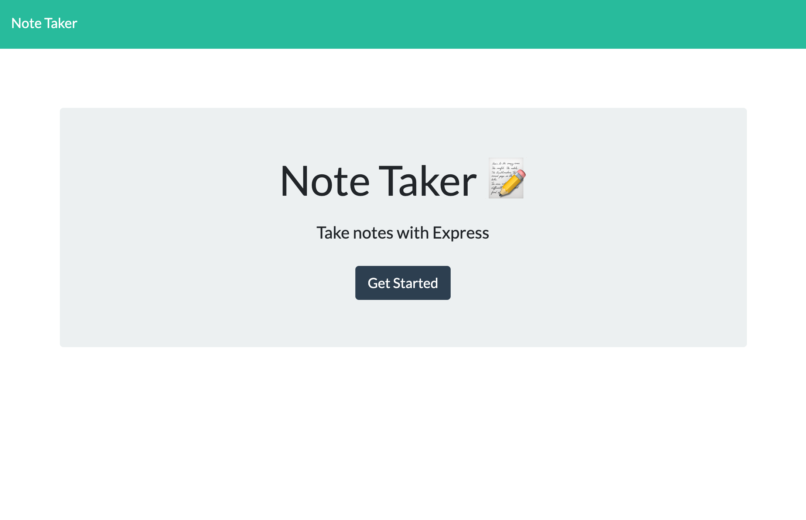
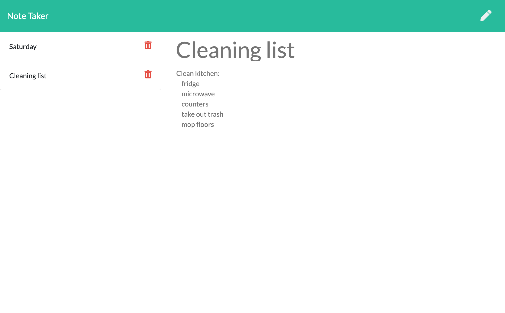

# Express Homework: Note Taker
This assignment was to create an application that can be used to write, save, and delete notes. This application will use an express backend and save and retrieve note data from a JSON file.

• Application should allow users to create and save notes.

• Application should allow users to view previously saved notes.

• Application should allow users to delete previously saved notes.    
&nbsp;

Acceptance Criteria
------------

1. Application should allow users to create and save notes.

2. Application should allow users to view previously saved notes.

3. Application should allow users to delete previously saved notes.

&nbsp;

## Deployed application:

   [Heroku Deploy](https://note-taker-hw-11.herokuapp.com/)

&nbsp;

